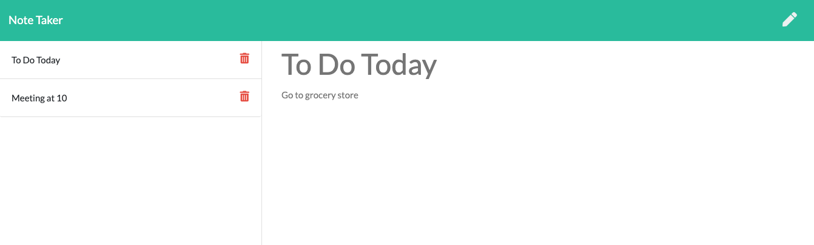
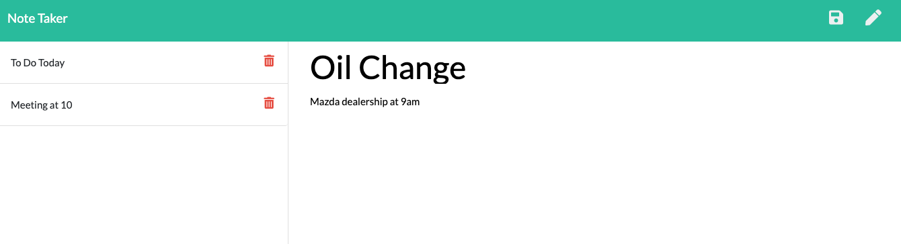

# Note-Taker

  ## Description

https://github.com/burnsgirl/Note-Taker

https://voyage-monsieur-93664.herokuapp.com/

This application is used to keep track of things you need to do or remember with notes. When you open the page you will hit 'Get Started' which will take you to the note home page. You will see on the left a list of notes you have made already that you can view. On the right you will see the ability to make a new note by clicking on the pencil. Once you have everything you would like in the note, the save icon will pop up for you to click on the save it to the list.

## Table of Contents
[Installation](#installation)

[Usage](#usage)

[Technologies Used](#technologies)

[License](#license)

[Contact](#contact)

## Installation
To use this application, you will need to install node and express on your device.

## Usage
You will use this site to create notes of things you need to do or remember. Once a note is created it will stay there until the user deletes the note.

## Technologies
Technologies used: HTML5, JavaScript, Express, CSS, Node, and Heroku.

## License
License: None

## Contact
Contact: DAUPHINEBURNS@GMAIL.COM
